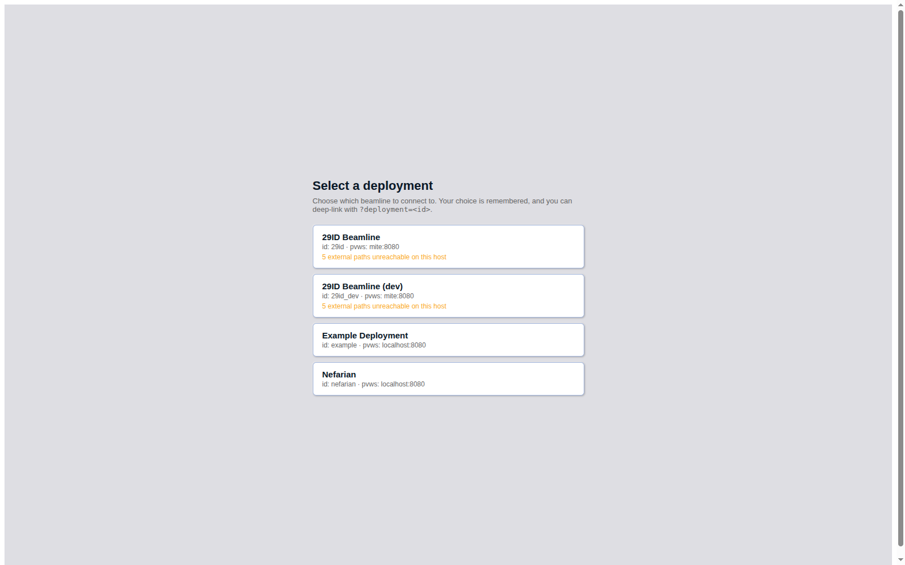
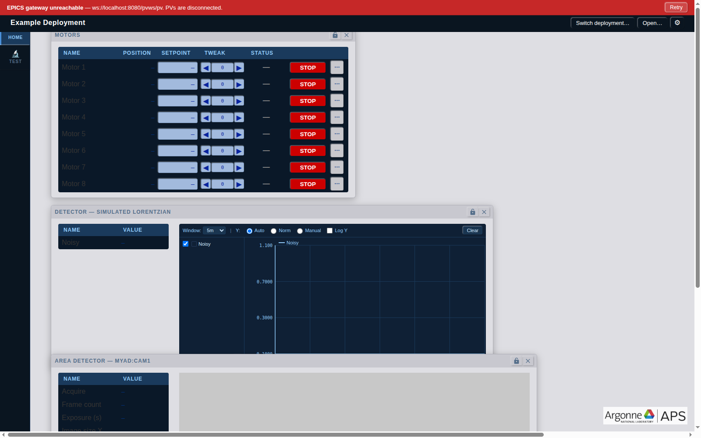
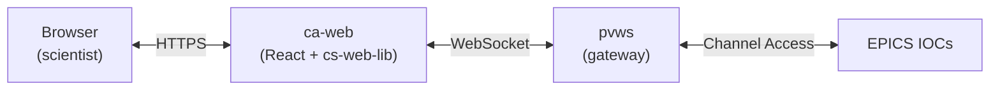

---
layout: aps
heading: The problem
---

caQtDM is the workhorse, but...

- runs only on desktop Linux
  - per-host install of caQtDM, Qt, MEDM, EPICS base
  - needs X11 / VNC / SSH to reach from a laptop
- display paths bound to NFS mounts on a specific host
- hard to share a view with a collaborator outside the beamline subnet
- no graceful fallback when the gateway flakes

---
layout: aps
heading: What ca-web is
---

- A **browser app** that renders existing caQtDM `.ui` files
  - same panels, same PV names, same look
  - no rewriting of beamline UIs
- Talks to EPICS through **pvws** (WebSocket gateway over Channel Access)
- One URL per beamline &mdash; no install on the user's machine
- React 18 &middot; TypeScript &middot; Vite &middot; `cs-web-lib` (Diamond Light Source)

---
layout: aps
heading: Pick a deployment
---

- One build, one URL &mdash; serves every beamline
- Deep-link with `?deployment=<id>`; choice remembered in `localStorage`
- Picker surfaces "paths unreachable" hints before the user clicks in

---
layout: aps
heading: A live panel
---

- Draggable, lockable panels; layouts persisted to git per deployment
- Motor controls, strip charts, area detector readouts in one view
- Red banner is **honest signal** &mdash; gateway state is always visible

---
layout: aps
heading: How it works
---

- `pvws` runs once per beamline subnet (Podman container)
- `.ui` files come from existing caQtDM display paths over NFS
- No new control system &mdash; same PVs, same IOCs

---
layout: aps
heading: Adding your beamline
---

**3 steps, no registration:**

1. Copy `src/deployments/example/` to `src/deployments/<your-id>/`
2. Edit `config.json` &mdash; set `id`, `title`, `pvws.socket`, tabs, panels
3. Point `paths.uiDirs` at your NFS display path &mdash; the picker auto-lists it

**Already deployed:**

| id | Title | pvws |
|---|---|---|
| `29id` | 29ID Beamline | `mite:8080` |
| `29id_dev` | 29ID (dev) | `mite:8080` |
| `example` | Template | `localhost:8080` |
| `nefarian` | Simulated IOC | `localhost:8080` |

---
layout: aps
heading: Widgets
---

**Read / write**

- `ChanRbvBox`, `ChanSpBox` &mdash; PV-backed readback/setpoint, precision from channel metadata
- `MotorCard` family &mdash; full, row, flat layouts on one `useMotor` hook
- `StripChart` &mdash; multi-PV rolling time series
- `DetectorSpectrum`, `CameraViewer`, `TempController`, `BlepsSector`

**Power-user features**

- Right-click any PV &rarr; info, copy name, plot
- Open any `.ui` file from the NFS display path
- Draggable panels; saved layouts committed to git per deployment
- Whole-app `ErrorBoundary` with auto-recovery

---
layout: aps
heading: Status and roadmap
---

**Today &mdash; v0.1.0-dev**

- 29ID staging running on real PVs
- Panel layouts persisted to git
- caQtDM `.ui` rendering pipeline covers the common widget set
- pvws connectivity gated at boot &mdash; no silent failures

**Next**

- `caWaveTable`, `caScriptButton`
- Click-to-move on strip charts and camera images
- Line profile on `caCamera`
- Color maps and histogram on images
- `sizePolicy: MinimumExpanding` for all widgets

---
layout: aps
heading: Want your beamline on ca-web?
---

Talk to **APS Controls** &mdash; or open an issue on the repo

`docs/architecture.md` &middot; `docs/deployments.md` &middot; `docs/widgets.md`

